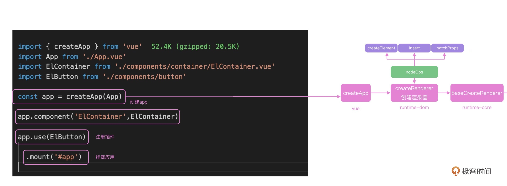
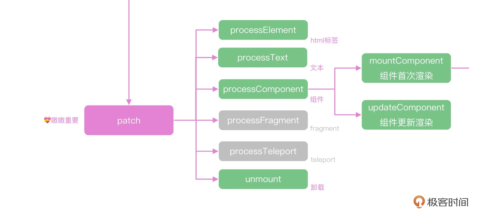

## VUE3的依赖图


## VUE3初始化的主线：

+ 实例创建的过程: `createApp({...code})`
+ 挂载过程：`app.mount()`

思考1：vue3如何做首次渲染和数据更新后的渲染 ？？ 实则就是上图所示的runtime-core的核心实现。


先说首次渲染：下图则是一个初始化app实例，并挂载到宿主元素上的过程，即首次渲染。


+ createApp内部调用ensureRenderer生成app实例。`const app = ensureRenderer().createApp(...args)`
+ 这里 ensureRenderer 函数，内部通过 createRenderer 函数，创建了一个浏览器的渲染器，并且缓存了渲染器 renderer.
+ createRenderer 函数传递的参数是 nodeOps 和 patchProp 的合并对象。而这两个参数都是浏览器的dom操作和浏览器的属性操作，具体维护在runtime-dom中。代码如下：

```js
// 浏览器dom操作
import { nodeOps } from './nodeOps'
// 浏览器dom属性更新
import { patchProp } from './patchProp'
import { createRenderer } from '@vue/runtime-core'
const rendererOptions = extend({ patchProp }, nodeOps)

let renderer: Renderer<Element | ShadowRoot> | HydrationRenderer

function ensureRenderer() {
  return (
    renderer ||
    (renderer = createRenderer<Node, Element | ShadowRoot>(rendererOptions))
  )
}  
```
+ createRenderer 是调用 baseCreateRenderer 创建的，baseCreateRenderer 函数内部有十几个函数，代码行数合计 2000 行左右。这其中都是之后渲染过程要调用的函数。baseCreateRenderer最终返回的是一个对象，其中包含render和createApp，并且createApp是通过一个工厂函数（render入参）生成的（实际上是 createAPI 的返回值）

```js
export function createRenderer<
  HostNode = RendererNode,
  HostElement = RendererElement
>(options: RendererOptions<HostNode, HostElement>) {
  return baseCreateRenderer<HostNode, HostElement>(options)
}

function baseCreateRenderer(){
    const {
    insert: hostInsert,
    remove: hostRemove,
    patchProp: hostPatchProp,
    createElement: hostCreateElement,
    createText: hostCreateText,
    createComment: hostCreateComment,
    setText: hostSetText,
    setElementText: hostSetElementText,
    parentNode: hostParentNode,
    nextSibling: hostNextSibling,
    setScopeId: hostSetScopeId = NOOP,
    cloneNode: hostCloneNode,
    insertStaticContent: hostInsertStaticContent
  } = options
  const patch = ()=>... //一个函数
  const processText = ()=>...
  const processCommentNode = ()=>...
  const processElement = ()=>...
  const mountElement = ()=>...
  const mountChildren = ()=>...
  const patchElement = ()=>...
  const patchBlockChildren = ()=>...
  const patchProps = ()=>...
  const processComponent = ()=>...
  const mountComponent = ()=>...
  const updateComponent = ()=>...
  const setupRenderEffect = ()=>...
  const patchChildren = ()=>...
  const patchKeyedChildren = ()=>...
  const unmount = ()=>...
  const unmountComponent = ()=>...
  const unmountComponent = ()=>...
  const unmountComponent = ()=>...
  const unmountComponent = ()=>...
  const render: RootRenderFunction = (vnode, container, isSVG) => {
    if (vnode == null) {
      if (container._vnode) {
        unmount(container._vnode, null, null, true)
      }
    } else {
      patch(container._vnode || null, vnode, container, null, null, null, isSVG)
    }
    flushPostFlushCbs()
    container._vnode = vnode
  }
  return {
    render,
    hydrate,
    createApp: createAppAPI(render, hydrate)
  }
}
```

+ 进入 createAppAPI 源码，看下面的代码。内部创建了一个 app 对象，app 上注册了我们熟悉的 use、component 和 mount 等方法。

```js
export function createAppAPI<HostElement>(
  render: RootRenderFunction,
  hydrate?: RootHydrateFunction
): CreateAppFunction<HostElement> {
  return function createApp(rootComponent, rootProps = null) {
    const context = createAppContext()
    let isMounted = false

    const app: App = (context.app = {
      _context: context,
      _instance: null,
      use(plugin: Plugin, ...options: any[]) ,
      component(name: string, component?: Component): any {
        if (!component) {
          return context.components[name]
        }
        context.components[name] = component
        return app
      },
      directive(name: string, directive?: Directive)
      mount(
        rootContainer: HostElement,
        isHydrate?: boolean,
        isSVG?: boolean
      ): any {
        if (!isMounted) {
          const vnode = createVNode(
            rootComponent as ConcreteComponent,
            rootProps
          )
          vnode.appContext = context
          // 核心的逻辑
          if (isHydrate && hydrate) {
            hydrate(vnode as VNode<Node, Element>, rootContainer as any)
          } else {
            <!-- 渲染目的：vnode =》 dom =》并挂载在rootContainer之上 -->
            render(vnode, rootContainer, isSVG)
          }
          return getExposeProxy(vnode.component!) || vnode.component!.proxy
        } 
      },

      provide(key, value) {
        context.provides[key as string] = value
        return app
      }
    })

    return app
  }
}
```

+ 通过createAppAPI创建了app实例，并绑定了相关的方法（如mount）则调用mount方法实现首次渲染。
+ 调用mount，在未挂载的情况下，创建一个vnode（其中入参的是根组件）以方便满足调用render函数的入参。所以说调用mount本质就是在调用render，目的是将将虚拟节点 转化成真实节点渲染到容器中。
+ 之后再看render内部，render的内部主要调用patch函数来实现首次渲染的过程。注意patch的入参，代码如下:
```js
  const render: RootRenderFunction = (vnode, container, isSVG) => {
    if (vnode == null) {
      if (container._vnode) {
        unmount(container._vnode, null, null, true)
      }
    } else {
      // 注意：此时第一个参数为null, 第二个参数为根组件虚拟节点，第三个参数为宿主元素
      patch(container._vnode || null, vnode, container, null, null, null, isSVG)
    }
    flushPostFlushCbs()
    container._vnode = vnode
  }
```

### patch的实现

+ patch 传递的是 container._vnode，也就是上一次渲染缓存的 vnode、本次渲染组件的 vnode，以及容器 container。
+ 下面用n1代表上次渲染的虚拟 DOM，n2 是下次要渲染的虚拟 DOM。首先可以把 n1 和 n2 做一次判断，如果虚拟 DOM 的节点类型不同，就直接 unmount 之前的节点。因为比如之前是 Button 组件，现在要渲染 Container 组件，就没有计算 diff 的必要，直接把 Button 组件销毁再渲染 Container 即可。
+ 如果 n1 和 n2 类型相同，比如都是 Button 组件或者都是 div 标签，我们需要判断具体的类型再去执行不同的函数，比如 processText、processFragment、processElement 以及 processComponent 等函数
+ 于此同时对n2的类型利用位运算的方式去判断它具体是text，element，component.....

```js
  const patch: PatchFn = (
    n1,
    n2,
    container,
    anchor = null,
    parentComponent = null,
    parentSuspense = null,
    isSVG = false,
    slotScopeIds = null,
    optimized = __DEV__ && isHmrUpdating ? false : !!n2.dynamicChildren
  ) => {
    // 两次虚拟dom完全一样 啥也不用干
    if (n1 === n2) {
      return
    }
    // 虚拟dom节点类型不一样， unmount老的虚拟dom，并且n1赋值null
    if (n1 && !isSameVNodeType(n1, n2)) {
      anchor = getNextHostNode(n1)
      unmount(n1, parentComponent, parentSuspense, true)
      n1 = null
    }
    // n2是要渲染的虚拟dom，我们获取type，ref和shapeFlag
    const { type, ref, shapeFlag } = n2
    switch (type) {
      case Text:
        // 文本
        processText(n1, n2, container, anchor)
        break
      case Comment:
        // 注释
        processCommentNode(n1, n2, container, anchor)
        break
      case Static:
        // 静态节点
        if (n1 == null) {
          mountStaticNode(n2, container, anchor, isSVG)
        } else if (__DEV__) {
          patchStaticNode(n1, n2, container, isSVG)
        }
        break
      case Fragment:
        processFragment(
          n1,
          n2,
          container,
          anchor,
          parentComponent,
          parentSuspense,
          isSVG,
          slotScopeIds,
          optimized
        )
        break
      default:
        // 运运算判断操作类型
        if (shapeFlag & ShapeFlags.ELEMENT) {
          // html标签
          processElement(
            n1,
            n2,
            container,
            anchor,
            parentComponent,
            parentSuspense,
            isSVG,
            slotScopeIds,
            optimized
          )
        } else if (shapeFlag & ShapeFlags.COMPONENT) {
          // 组件
          processComponent(
            n1,
            n2,
            container,
            anchor,
            parentComponent,
            parentSuspense,
            isSVG,
            slotScopeIds,
            optimized
          )
        } else if (shapeFlag & ShapeFlags.TELEPORT) {
          ;(type as typeof TeleportImpl).process(
            n1 as TeleportVNode,
            n2 as TeleportVNode,
            container,
            anchor,
            parentComponent,
            parentSuspense,
            isSVG,
            slotScopeIds,
            optimized,
            internals
          )
        } else if (__FEATURE_SUSPENSE__ && shapeFlag & ShapeFlags.SUSPENSE) {
          ;(type as typeof SuspenseImpl).process(
            n1,
            n2,
            container,
            anchor,
            parentComponent,
            parentSuspense,
            isSVG,
            slotScopeIds,
            optimized,
            internals
          )
        } else if (__DEV__) {
          warn('Invalid VNode type:', type, `(${typeof type})`)
        }
    }

    // set ref
    if (ref != null && parentComponent) {
      setRef(ref, n1 && n1.ref, parentSuspense, n2 || n1, !n2)
    }
  }
```



+ 由于首次渲染的 App 是一个组件，所以要执行的就是 processComponent 方法（进入）。首次渲染的时候，n1 就是 null，所以会执行 mountComponent；如果是更新组件的时候，n1 就是上次渲染的 vdom，需要执行 updateComponent。

```js
  const processComponent = (
    n1: VNode | null,
    n2: VNode,
    container: RendererElement,
    anchor: RendererNode | null,
    parentComponent: ComponentInternalInstance | null,
    parentSuspense: SuspenseBoundary | null,
    isSVG: boolean,
    slotScopeIds: string[] | null,
    optimized: boolean
  ) => {
    n2.slotScopeIds = slotScopeIds
    if (n1 == null) {
      if (n2.shapeFlag & ShapeFlags.COMPONENT_KEPT_ALIVE) {
        ;(parentComponent!.ctx as KeepAliveContext).activate(
          n2,
          container,
          anchor,
          isSVG,
          optimized
        )
      } else {
        mountComponent(
          n2,
          container,
          anchor,
          parentComponent,
          parentSuspense,
          isSVG,
          optimized
        )
      }
    } else {
      updateComponent(n1, n2, optimized)
    }
  }
```

+ 进入 mountComponent 函数中，主要做了以下三件事：重点在2，3
    1. 创建组件实例。
    2. 组件初始化（包括props，slot的初始化，setup的执行）
    3. 创建一个组件更新函数，建立组件更新机制

1. 组件的初始化setupComponent

首先内部先初始化了 props 和 slots，并且执行 setupStatefulComponent 创建组件，而这个函数内部从 component 中获取 setup 属性(也就是 script setup 内部实现的函数)并执行，就进入到我们组件内部的 reactive、ref 等函数实现的逻辑了（之后响应式再说）

代码如下：
```js
export function setupComponent(
  instance: ComponentInternalInstance,
  isSSR = false
) {
  isInSSRComponentSetup = isSSR

  const { props, children } = instance.vnode
  const isStateful = isStatefulComponent(instance)
  initProps(instance, props, isStateful, isSSR)
  initSlots(instance, children)

  // 取得setup执行结果，返回
  const setupResult = isStateful
    ? setupStatefulComponent(instance, isSSR)
    : undefined
  isInSSRComponentSetup = false
  return setupResult
}

function setupStatefulComponent(
  instance: ComponentInternalInstance,
  isSSR: boolean
) {
  const Component = instance.type as ComponentOptions
  // 执行setup
  const { setup } = Component
  if (setup) {
    const setupContext = (instance.setupContext =
      setup.length > 1 ? createSetupContext(instance) : null)

    setCurrentInstance(instance)
    pauseTracking()
    const setupResult = callWithErrorHandling(
      setup,
      instance,
      ErrorCodes.SETUP_FUNCTION,
      [instance.props, setupContext]
    )
    if (isPromise(setupResult)) {
      setupResult.then(unsetCurrentInstance, unsetCurrentInstance)
    } else {
      handleSetupResult(instance, setupResult, isSSR)
    }
  } else {
    finishComponentSetup(instance, isSSR)
  }
}

export function callWithErrorHandling(
  fn: Function,
  instance: ComponentInternalInstance | null,
  type: ErrorTypes,
  args?: unknown[]
) {
  let res
  try {
    res = args ? fn(...args) : fn()
  } catch (err) {
    handleError(err, instance, type)
  }
  return res
}
```

2. setupRenderEffect

+ 主要作用：这个函数内部不仅实现了组件的递归渲染，还注册了组件的更新机制。

+ 具体来看，首先定义组件更新函数（componentUpdateFn）。其中：
    1. 首次渲染会被调用，内部是调用patch去递归初始化子元素或者子组件
    2. 当组件内部响应式数据更改时再次渲染，componentUpdateFn会再次被调用。内部同样是调用patch函数来做更新
+ 定义副作用函数（create reactive effect for rendering）effect中的componentUpdateFn会在响应数据发生变化时，再次执行
+ 定义update函数，其中执行effect副作用函数中的组件更新函数。即：` const update: SchedulerJob = (instance.update = () => effect.run())`
+ 最后，首次渲染的时候会调用以下update函数。内部调用componentUpdateFn =》 patch =》 processElement =》mountElement =》 hostSetElementText（处理子元素为text的情况） | mountChildren(处理子元素为数组的情况：遍历每一个子元素并渲染：for+patch) | hostPatchProp（遍历属性并进行相应的操作） | hostInsert （将当前的el挂载到container之上）

代码如下：
```js
    if (!instance.isMounted) {
         patch(
            null,
            subTree,
            container,
            anchor,
            instance,
            parentSuspense,
            isSVG
          )
    }else{
      // updateComponent
    }
    // create reactive effect for rendering
    const effect = new ReactiveEffect(
      componentUpdateFn,
      () => queueJob(instance.update),
      instance.scope // track it in component's effect scope
    )

    const update = (instance.update = effect.run.bind(effect) as SchedulerJob)
    update.id = instance.uid
    
    // 首次渲染调用
    update()
```

## 总结：

Vue 通过 createApp 创建应用，并且执行返回的 mount 方法实现在浏览器中的挂载，在 createApp 中，通过传递浏览器平台的操作方法 nodeOps 创建了浏览器的渲染器 renderer。

首次执行 Vue 项目的时候，通过 patch 实现组件的渲染，patch 函数内部根据节点的不同类型，去分别执行 processElement、processComponent、processText 等方法去递归处理不同类型的节点。

最终通过 setupComponent 执行组件的 setup 函数，setupRenderEffect 中使用响应式的 effect 函数监听数据的变化。