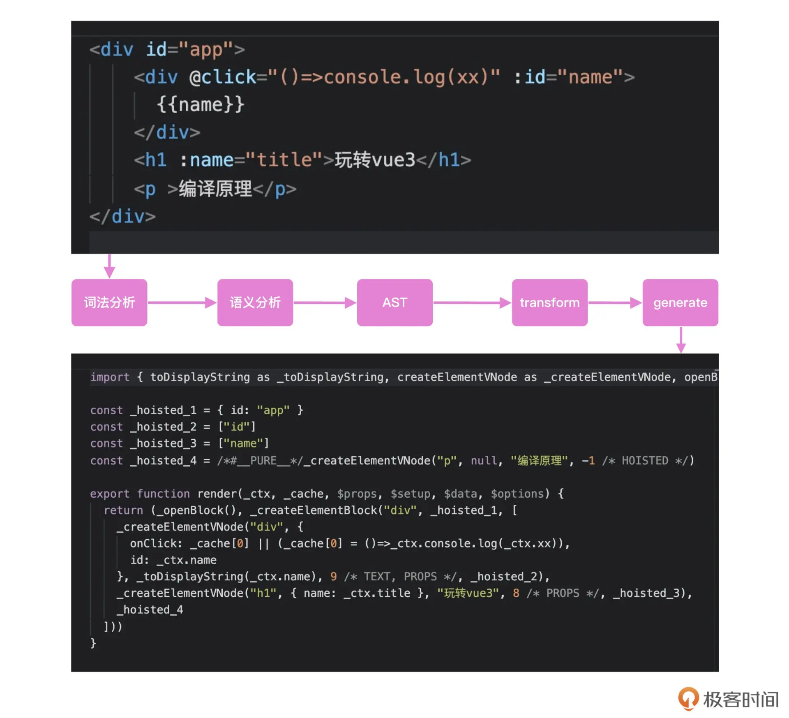

Compile 的核心流程：

在运行时之外，如果用户配置了template模板，vue需要将模板先编译成render函数，在运行时才可以使用。

至于compile的过程，大致可以通过下图展示：



总的来说：
1. Parse：将template转换为AST语法树,对模板先进行词法分析，转换为一个个token（数组对象），但此时没有层级关系。
    + 层级关系：可以维护一个栈结构，用来存放节点对应的标签。当压入栈的标签与栈顶元素一致时，则出栈，并将栈顶元素对应的节点推入它的父节点的children属性中。这样层级关系即可生成。
    + 当tokens转换成一个有层级关系的节点树的时候，AST基本就已经形成.
2. Transform：对AST进行递归辨析, 分析每一个节点: 去处理节点的不同的属性(为不同的属性打上标记, 此处用到位运算, 组合权限), 标记静态节点, 处理插值文本等等.
3. Generate最后将语法树生成Render函数: 还是递归遍历整个被优化过的AST树, 进行字符串与方法的拼接, 生成一个大的字符串形式的render函数.

```js
const PatchFlags = {
  "TEXT": 1, // 000001
  "CLASS": 1 << 1, // 00010
  "STYLE": 1 << 2, // 00100
  "PROPS": 1 << 3, // 01000
  "EVENT": 1 << 4, // 10000
}


// 将template分解成一个个tokens（开始标签，结束标签，属性，text）
function tokenizer(input) {
  let tokens = []
  let type = ''
  let val = ''
  // 粗暴循环
  for (let i = 0; i < input.length; i++) {
    let ch = input[i]
    if (ch === '<') {
      push()
      if (input[i + 1] === '/') {
        type = 'tagend'
      } else {
        type = 'tagstart'
      }
    } if (ch === '>') {
      if (input[i - 1] == '=') {
        //箭头函数
      } else {
        push()
        type = "text"
        continue
      }
    } else if (/[\s]/.test(ch)) { // 碰见空格夹断一下
      push()
      type = 'props'
      continue
    }
    val += ch
  }
  return tokens

  function push() {
    if (val) {
      if (type === "tagstart") val = val.slice(1) // <div => div
      if (type === "tagend") val = val.slice(2)   //  </div  => div
      tokens.push({
        type,
        val
      })
      val = ''
    }
  }
}

function parse(template) {

  const tokens = tokenizer(template)
  let cur = 0
  let ast = {
    type: 'root',
    props: [],
    children: []
  }
  while (cur < tokens.length) {
    ast.children.push(walk())
  }
  return ast

  function walk() {
    let token = tokens[cur]
    if (token.type == 'tagstart') {
      let node = {
        type: 'element',
        tag: token.val,
        props: [],
        children: []
      }
      token = tokens[++cur]
      while (token.type !== 'tagend') {
        if (token.type == 'props') {
          node.props.push(walk())
        } else {
          // 包括了text和子节点
          node.children.push(walk())
        }
        token = tokens[cur]
      }
      // 跳过type为"tagend"的token
      cur++
      return node
    }
    if (token.type === 'tagend') {
      cur++
      // return token
    }
    if (token.type == "text") {
      cur++
      return token
    }
    if (token.type === "props") {
      cur++
      const [key, val] = token.val.replace('=','~').split('~')
      return {
        key,
        val
      }
    }
  }
}
function transform(ast) {
  // 优化一下ast
  let context = {
    // import { toDisplayString , createVNode , openBlock , createBlock } from "vue"
    helpers: new Set(['openBlock', 'createVnode']), // 用到的工具函数 
  }
  traverse(ast, context)
  ast.helpers = context.helpers
}
function traverse(ast, context) {
  switch (ast.type) {
    case "root":
      context.helpers.add('createBlock')
    // log(ast)
    case "element":
      ast.children.forEach(node => {
        traverse(node, context)
      })
      // 为属性的类型进行标记，采用位运算的方式，初始值为0
      ast.flag = 0
      // 开始循环处理所有属性的标记
      ast.props = ast.props.map(prop => {
        const { key, val } = prop
        if (key[0] == '@') {
          ast.flag |= PatchFlags.EVENT // 标记event需要更新
          return {
            key: 'on' + key[1].toUpperCase() + key.slice(2),
            val
          }
        }
        if (key[0] == ':') {
          const k = key.slice(1)
          if (k == "class") {
            ast.flag |= PatchFlags.CLASS // 标记class需要更新

          } else if (k == 'style') {
            ast.flag |= PatchFlags.STYLE // 标记style需要更新
          } else {
            ast.flag |= PatchFlags.PROPS // 标记props需要更新
          }
          return {
            key: key.slice(1),
            val
          }
        }
        if (key.startsWith('v-')) {
          // pass such as v-model 
        }
        //标记static是true 静态节点
        return { ...prop, static: true }
      })
      break
    case "text":
      // trnsformText
      let re = /\{\{(.*)\}\}/g
      // 用来匹配 {{}}
      if (re.test(ast.val)) {
        //有{{
        ast.flag |= PatchFlags.TEXT // 标记props需要更新
        context.helpers.add('toDisplayString')
        ast.val = ast.val.replace(/\{\{(.*)\}\}/g, function (s0, s1) {
          return s1
        })
      } else {
        ast.static = true
      }
  }
}
function generate(ast) {
  const { helpers } = ast

  let code = `
import {${[...helpers].map(v => v + ' as _' + v).join(',')}} from 'vue'\n
export function render(_ctx, _cache, $props){
  return(_openBlock(), ${ast.children.map(node => walk(node))})}`

  function walk(node) {
    switch (node.type) {
      case 'element':
        let { flag } = node // 编译的标记
        let props = '{' + node.props.reduce((ret, p) => {
          if (flag.props) {
            //动态属性
            ret.push(p.key + ':_ctx.' + p.val.replace(/['"]/g, ''))
          } else {
            ret.push(p.key + ':' + p.val)
          }

          return ret
        }, []).join(',') + '}'
        return `_createVnode("${node.tag}",${props}),[
          ${node.children.map(n => walk(n))}
        ],${JSON.stringify(flag)}`
        break
      case 'text':
        if (node.static) {
          return '"' + node.val + '"'
        } else {
          return `_toDisplayString(_ctx.${node.val})`
        }
        break
    }
  }
  return code
}

export function compiler(template) {
  const ast = parse(template)
  transform(ast)

  const code = generate(ast)
  return code
}
```